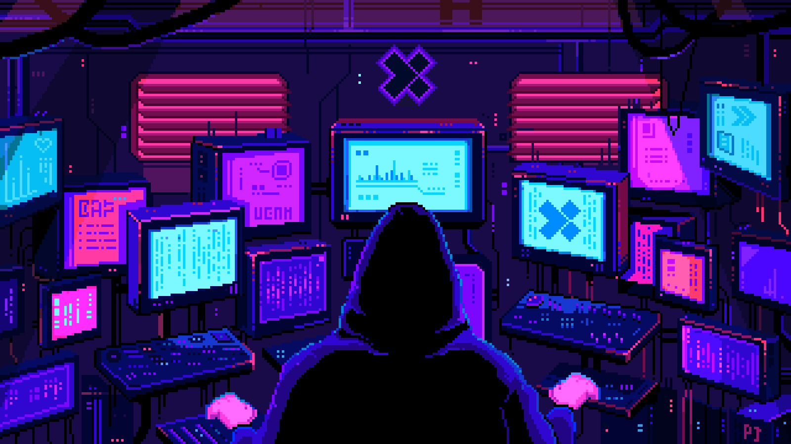
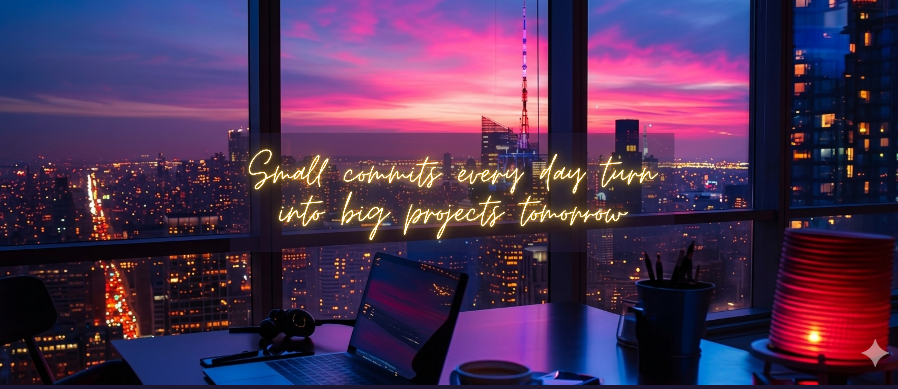

 <h2>Hi I'm Alisha Asmat 👋</h2>

 
 

I'm currently pursuing a Bachelor's degree in Information Technology, actively working on improving my programming skills. My academic and personal learning journey is focused on building a solid foundation in **Web Development** while exploring new technologies. I am particularly passionate about **Full Stack Development**, and I aim to transition into **Software Development** as a long-term career path.

  
## 💫 About Me

  

<table border="0">
  <tr style="border: none;">
    <td width="70%" style="border: none; vertical-align: top;">
      
* ✨ I am currently working on developing my programming skills.
* 💻 I worked on **.NET Framework** and have experience in building a **Cafe Management System** using **C#**.
* 🚀 Strong interest in **Web Development** and **Software Engineering**.
* 📚 I love learning new things and building modern web applications.
* 🔥 Current Focus: **MERN Stack** (MongoDB, Express, React, Node.js).
      
    </td>
    <td width="30%" align="right" style="border: none; vertical-align: top;">
      
    </td>
  </tr>
</table>

  
<h2 align="center"> 📊 GitHub Status </h2>

  
  

  

 
<h2 align="center"> 🛠 Languages & Tools I Have Placed My Hands On </h2>

  

  

  

 
<h2 align="center"> 💻 Tech Stack </h2>

  <strong>Frontend:</strong> 
  
  
  
  

  <strong>Backend & Database:</strong> 
  
  
  
  
  

  <strong>Design & Tools:</strong> 
  
  
  

  

  

